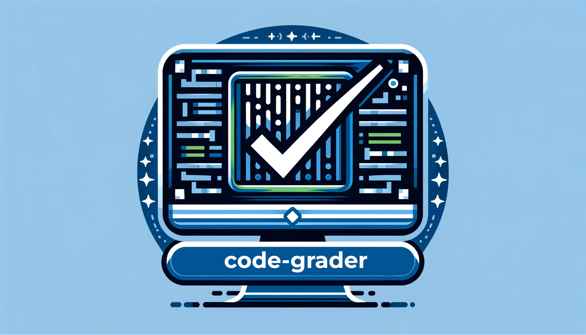

# code-grader
Automatic code evaluation
___

"code-grader" is a software tool designed to automatically evaluate and grade coding assignments or projects. It aims to streamline the process of code assessment.

## !!! The software is still at development !!!

---

## The plan

- Frontend: HTML/CSS + React
- Backend: C++ server

### Frontend
  - React

### Backend

- web framework: crow and boost (or oat++), 
- dockerizing the evaluation should be easy and does not involve any special libraries, only docker should be installed
- TODO: concurrency and parallelism might be done by the web framework but I might also need to use some other library to implement task queue like Poco Libraries Qt Framework C++ Actor Framework, Folly or Boost.Asio or it may be done simply using std::async along with std::future and std::promise be - needs more research 
- TODO: database: MySQL or PostgreSQL alongside with a C++ driver for access - which one of them? which driver?
- TODO: login ???

